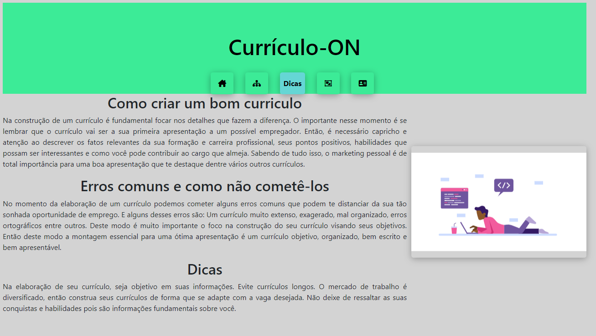
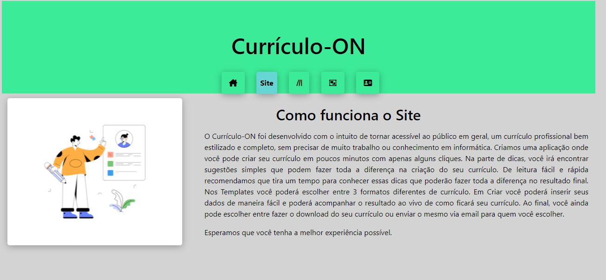
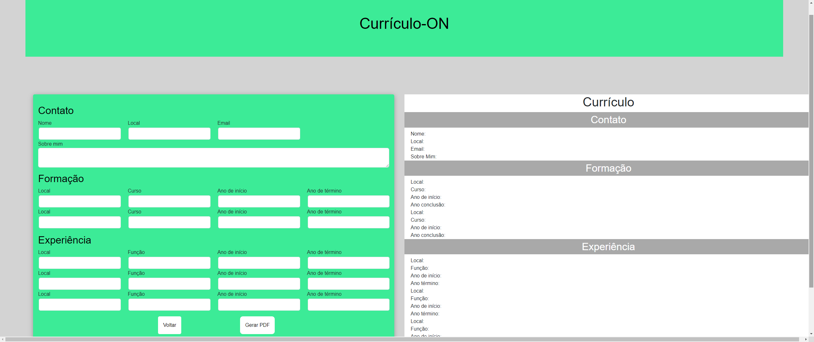

# Programação de Funcionalidades

do sistema. O respectivo endereço (URL) e outras orientações de acesso são são
Nesta seção são apresentadas as telas e funcionalidades desenvolvidas para a aplicação CvApply, voltada para geração e adaptação de currículos com auxílio de modelos de linguagem (LLM). O respectivo endereço (URL) e outras orientações de acesso são apresentadas na sequência.

Visualização da aplicação e dicas (RF-003)
A tela principal destaca a facilidade que a aplicação propõe, permitindo montar e adaptar o CV conforme vagas específicas. A segunda página traz uma síntese de como a aplicação funciona, incluindo o uso de LLM para personalização. Na página 3 se encontram dicas para facilitar na montagem e adaptação do CV.

Requisitos atendidos
  - RF-003
  - RF-007
  
Artefatos de funcionalidade
  - index.html
  - app.js
  - style.scss
 

 


O menu interativo e funcional (RF-007)
O menu interativo é fixo em todas as páginas principais, facilitando a navegação entre elas. E na página de criação do CV, existe a opção de voltar e reiniciar o projeto.


Requisitos atendidos
  - RF-007
  - RF-005

Artefatos de funcionalidade
  - template.html
  - template2.html
  - template3.html
  

  
Instruções de acesso
3. Faça o download do arquivo do projeto (ZIP) ou clone do projeto no GitHub;
4. Descompacte o arquivo em uma pasta específica;
5. Abra o Visual Studio Code e execute o Live Server;
6. Abra um navegador de Internet e informe a seguinte URL:
http://localhost:5500/index.html


## Instalação e Execução

Opção rápida: abra `src/index.html` diretamente no navegador.

Servidor local (recomendado): sirva a pasta `src` com um servidor HTTP estático.

Exemplos:

```
# Python 3
python -m http.server -d src 5500

# Node (npx serve)
npx serve src -l 5500
```

Acesse: http://localhost:5500

## FAQ / Troubleshooting

- Página não carrega estilos? Verifique caminhos relativos para `styles/` e `images/`.
- Exportação para PDF sem formatação: use a opção de “Imprimir como PDF” do navegador e habilite “Gráficos de fundo”.
- Porta já em uso (5500): escolha outra porta livre (ex.: 8080).
