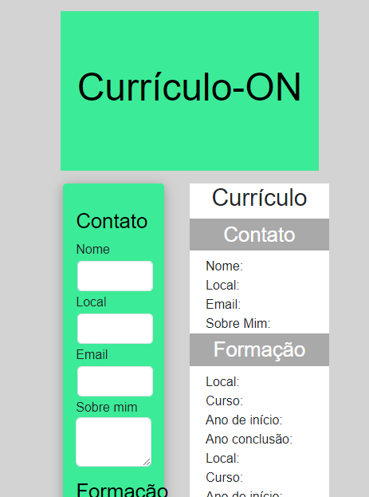
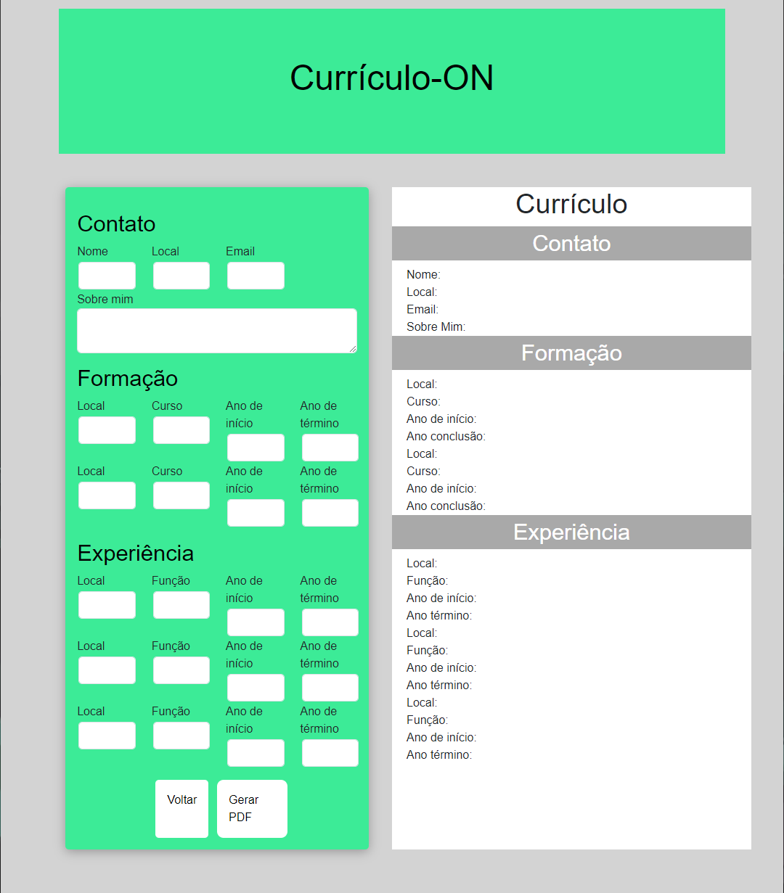

# Registro de Testes de Software

Pré-requisitos: <a href="3-Projeto de Interface.md"> Projeto de Interface</a>, <a href="8-Plano de Testes de Software.md"> Plano de Testes de Software</a>

9. Registros de Teste de Software

| Registro de Teste| CT-01 - Montagem de CV| 
|--------------|-----------------------|
|Objetivo de teste|Conferir o acesso e a qualidade das informações disponibilizadas para a montagem de um CV.|
|Critério de êxito|•	O teste teve êxito|

|Registro de teste| CT-02 – Navegabilidade|
|-------------|----------------------------------------------------------------|
|Objetivo do Teste| Pensado especialmente para pessoas que enfrentam dificuldades ao lidar com tarefas ou aplicações online.|
|Critérios de Êxito|•	O teste teve êxito.|
 
|Registro de teste| CT-03 – Responsividade|
|-------------|----------------------------------------------------------------|
|Objetivo do Teste| Pensado especialmente para pessoas que utilizam celulares ou dispositivos móveis para a maioria das tarefas diárias.|
|Critérios de Êxito|•	A aplicação mostra alguns pontos falhos, porém tem um bom nível de responsividade.|

|Registro de teste| CT-04 – Envio por email|
|-------------|----------------------------------------------------------------|
|Objetivo do Teste| Acessar a funcionalidade de envio por email|
|Critérios de Êxito|•	A aplicação não apresentou a funcionalidade de envio por email.|

|Registro de teste| CT-05 – Salvar em formato PDF|
|-------------|----------------------------------------------------------------|
|Objetivo do Teste| Salvar o CV em formato PDF|
|Critérios de Êxito|•	A aplicação apresentou a funcionalidade de salvar como PDF.|

## Avaliação

A aplicação ainda precisa ser melhor codificada para ser considerado funcional. 
